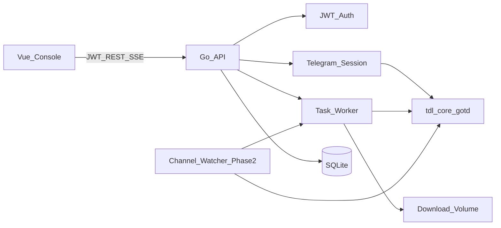

# tdload 开发文档

自托管 Telegram 批量下载与监控控制台。后端 Go 单体集成 [iyear/tdl](https://github.com/iyear/tdl)（`tdl/core` + `gotd`），前端 Vue 控制台；Docker 部署到 amd64 / arm64 Linux。仓库内 `xtools/` 仅作产品与部署参考，不进入运行时依赖。

许可证：**AGPL-3.0**（与 tdl 一致）。

相关文档：

- [tdl 官方文档](https://docs.iyear.me/tdl/)
- [tdl 下载指南](https://docs.iyear.me/tdl/guide/download/)
- 参考样板：[xtools/README.md](../xtools/README.md)

---

## 1. 目标与范围

### 1.1 目标

控制台以 **Telegram 账号为中心**：先同步对话与收藏，再在「频道」浏览覆盖进度并继续下载，在「任务」处理消息链接与收藏同步；全程 **自动跳过已下载**（`media_index` + 磁盘存在性），进度经 SSE 推送。

| 能力 | 说明 |
|------|------|
| 鉴权 | 控制台 JWT + Telegram session |
| **Telegram 页** | 登录 / 退出；**刷新**频道·群组·收藏缓存；展示 **频道（对话）数**、**收藏数** |
| **频道页** | 已加入的频道与群组：覆盖进度、已下载数；详情页「继续下载」工作台 |
| **任务页（2 Tab）** | 消息下载 / 收藏同步（见 §7.2） |
| **资源库** | 已下载索引、筛选、预览、扫盘同步 |
| **监听** | 频道 / 群 / 收藏增量自动入队（仅水位扫描，无扩展名/大小过滤） |
| 部署 | 单镜像 Docker，`linux/amd64` / `linux/arm64`；本机前后端分离调试 |

**落盘目录（相对 `download_dir`）：**

- 收藏：`我的收藏/`
- 其它消息：`{频道id}_{频道名称}/`（与当前 Worker `chatFolderName` 一致；名称需安全化）

### 1.2 分期

| 阶段 | 内容 |
|------|------|
| **一期** | 对话/收藏同步 + 频道工作台 + 任务两 Tab + 队列/SSE + 资源库 |
| **二期** | 监听增量自动入队（复用同一任务模型与去重） |

### 1.3 一期非目标

上传、转发、多用户、桌面端、内置 MySQL。

---

## 2. 已确认技术决策

| 项 | 决策 |
|----|------|
| 后端 | Go 单体：HTTP API + Worker +（二期）Watcher，单二进制 |
| Telegram | `github.com/iyear/tdl/core` + `gotd`；下载对齐 tdl `pkg/downloader` 的 Iter / Progress |
| 前端 | Vue 3 + Vite + Naive UI + Pinia + Vue Router（对齐 xtools/web） |
| 数据库 | SQLite（文件落在配置卷，单容器友好） |
| 配置 | YAML 运行时配置 + 环境变量机密（对齐 xtools） |
| 鉴权 | 单用户 JWT Bearer；媒体流可用短时 ticket（勿把会话 JWT 放进 URL） |
| 参考代码 | `xtools/` 只读参考，禁止 `import` / 拷贝进构建依赖 |
| 开源 | 整仓 AGPL-3.0 |

---

## 3. 总体架构



### 3.1 进程模型

一个进程内包含：

1. **API**：REST + SSE + 静态前端托管  
2. **Worker**：消费 `queued` 任务，调用 tdl 下载，写盘与更新 DB  
3. **Watcher（二期）**：监听对话增量，命中后入队  

关机时 drain 进行中任务（有超时上限），未完成任务下次启动重新入队。

### 3.2 数据流（一期下载）

1. 用户在 Web 粘贴 `t.me/...` 链接或上传 `result.json`  
2. API 解析为 `task` + `task_items`，状态 `queued`  
3. Worker 取任务 → 构建 Iter → `Downloader.Download`  
4. `Progress` 回调 → 内存事件总线 → SSE `/api/events`  
5. 完成后写 `media_index`，状态 `done` / `failed`

### 3.3 数据流（二期监听）

1. 用户选择对话写入 `watched_chats`（加入时记录当前最新 message id 为水位，不立刻下载）
2. Watcher 按间隔扫描，取 `(水位, 最新]` 增量
3. 有新媒体 → 自动创建 `watch` / `watch_saved` 任务入队
4. 后续与一期 Worker 相同（`skip_same` 去重）

---

## 4. 仓库布局（规划）

```
tdload/
├── xtools/                      # 参考样板（勿依赖）
├── docs/
│   └── DEVELOPMENT.md           # 本文档
├── cmd/
│   └── tdload/
│       └── main.go
├── internal/
│   ├── api/                     # HTTP handlers / 路由
│   ├── auth/                    # JWT、ticket、管理员引导
│   ├── config/                  # YAML + env
│   ├── db/                      # SQLite schema / migrations
│   ├── tg/                      # session、登录（验证码/二维码）、client 池
│   ├── downloader/              # 封装 tdl 下载、链接/JSON 解析、进度适配
│   ├── worker/                  # 任务调度与槽位
│   ├── watcher/                 # 二期：频道/群监听
│   ├── progress/                # SSE 事件总线
│   ├── library/                 # 已下载索引与文件服务
│   └── static/                  # embed 或 WEB_DIR 静态资源
├── web/                         # Vue 控制台
├── Dockerfile
├── docker-compose.yml
├── .dockerignore
├── .env.example
├── config.example.yaml
├── go.mod
├── LICENSE                      # AGPL-3.0
├── NOTICE                       # 第三方（含 tdl）声明
└── README.md
```

---

## 5. 配置设计

持久化运行时配置为 YAML；数据库路径、管理员、JWT 等用环境变量。首次启动若 `jwt_secret` 为空则自动生成并写回 YAML。

### 5.1 `config.example.yaml`

```yaml
bind: "0.0.0.0:3030"
download_dir: "/tdload/downloads"
web_dir: "/app/web"
db_path: "/tdload/config/tdload.db"
session_dir: "/tdload/config/session"

# Telegram API（也可由环境变量覆盖）
# 申请：https://my.telegram.org
app_id: 0
app_hash: ""

# 下载参数（对齐 tdl CLI 语义）
threads: 8          # 单任务分片线程 -t
concurrency: 4      # 并发任务数 -l
skip_same: true     # --skip-same
group_album: true   # --group
rewrite_ext: false  # --rewrite-ext
takeout: false      # --takeout（大批量更友好）
no_image: false     # 界面无图模式（资源库预览占位）
template: "{{ .DialogID }}_{{ .MessageID }}_{{ .FileName }}"

proxy: ""           # 例: socks5://127.0.0.1:1080
jwt_secret: ""
```

### 5.2 环境变量

| 变量 | 必填 | 说明 |
|------|------|------|
| `ADMIN_USERNAME` | 是 | 控制台管理员，首次启动建号 |
| `ADMIN_PASSWORD` | 是 | 同上；已有用户后不覆盖 |
| `BIND` | 否 | 默认 `0.0.0.0:3030`；本地调试可用 `0.0.0.0:3000` |
| `CONFIG_PATH` | 否 | 默认 `/tdload/config/config.yaml` |
| `WEB_DIR` | 否 | 前端静态目录 |
| `TG_APP_ID` / `TG_APP_HASH` | 建议 | 覆盖 YAML 中的 app 凭证 |
| `JWT_SECRET` | 否 | 空则自动生成写回 YAML |

机密与 session **禁止**打进镜像层，只走挂载卷。

---

## 6. 数据模型草案

SQLite。迁移用编号 SQL 或轻量迁移库（如 `golang-migrate` / 自研 embed）。

### 6.1 `users`

| 列 | 类型 | 说明 |
|----|------|------|
| id | INTEGER PK | |
| username | TEXT UNIQUE | |
| password_hash | TEXT | argon2id / bcrypt |
| created_at | TEXT | RFC3339 |

单用户：仅支持一个管理员账号。

### 6.2 `tg_accounts`

| 列 | 类型 | 说明 |
|----|------|------|
| id | INTEGER PK | |
| label | TEXT | 显示名 |
| phone | TEXT | 可空（QR 登录） |
| user_id | INTEGER | Telegram user id |
| session_file | TEXT | 相对 `session_dir` 的路径 |
| status | TEXT | `pending` / `active` / `expired` / `error` |
| proxy | TEXT | 可覆盖全局 proxy |
| last_error | TEXT | |
| created_at / updated_at | TEXT | |

一期可先支持单账号；表结构预留多账号。

### 6.3 `tasks`

| 列 | 类型 | 说明 |
|----|------|------|
| id | INTEGER PK | |
| source | TEXT | `url` / `json` / `chat_range` / `watch` |
| title | TEXT | 展示标题 |
| status | TEXT | `queued` / `running` / `paused` / `done` / `failed` / `cancelled` |
| tg_account_id | INTEGER FK | |
| options_json | TEXT | 覆盖全局 threads/concurrency 等 |
| total_bytes | INTEGER | |
| done_bytes | INTEGER | |
| total_files | INTEGER | |
| done_files | INTEGER | |
| speed_bps | INTEGER | 最近采样 |
| error | TEXT | |
| created_at / started_at / finished_at | TEXT | |

### 6.4 `task_items`

| 列 | 类型 | 说明 |
|----|------|------|
| id | INTEGER PK | |
| task_id | INTEGER FK | |
| chat_id | INTEGER | |
| message_id | INTEGER | |
| file_name | TEXT | |
| size | INTEGER | |
| status | TEXT | `pending` / `downloading` / `done` / `skipped` / `failed` |
| local_path | TEXT | |
| error | TEXT | |

唯一约束建议：`(task_id, chat_id, message_id)`。

### 6.5 `media_index`

| 列 | 类型 | 说明 |
|----|------|------|
| id | INTEGER PK | |
| chat_id | INTEGER | |
| message_id | INTEGER | |
| file_name | TEXT | |
| size | INTEGER | |
| local_path | TEXT | |
| mime | TEXT | |
| downloaded_at | TEXT | |

唯一约束：`(chat_id, message_id, size)`，配合 `skip_same`。

### 6.6 `task_logs`

| 列 | 类型 | 说明 |
|----|------|------|
| id | INTEGER PK | |
| task_id | INTEGER FK | |
| level | TEXT | `info` / `warn` / `error` |
| message | TEXT | |
| created_at | TEXT | |

### 6.7 `watched_chats`（二期）

| 列 | 类型 | 说明 |
|----|------|------|
| id | INTEGER PK | |
| tg_account_id | INTEGER FK | |
| chat_id | INTEGER | |
| chat_title | TEXT | |
| enabled | INTEGER | 0/1 |
| last_message_id | INTEGER | 水位 |
| filter_json | TEXT | 预留列，固定 `{}`（不再使用扩展名/大小等过滤） |
| created_at / updated_at | TEXT | |

### 6.8 `tg_dialogs`（一期 · 缓存）

Telegram 页点「刷新」后写入；频道页只读此表（必要时后台补全计数）。

| 列 | 类型 | 说明 |
|----|------|------|
| id | INTEGER PK | |
| tg_account_id | INTEGER FK | |
| chat_id | INTEGER | Bot API 风格 id（频道多为 `-100…`） |
| title | TEXT | 显示名 |
| username | TEXT | `@` 可空 |
| kind | TEXT | `channel` / `supergroup` / `group` / `user` / `saved` 等 |
| message_count | INTEGER | 对话消息总数（能取则填；取不到可为 -1 + 按需刷新） |
| downloaded_count | INTEGER | 来自 `media_index` 聚合 |
| last_message_id | INTEGER | 对话最新消息 id（频道下载进度用） |
| synced_at | TEXT | 上次同步时间 |

唯一约束：`(tg_account_id, chat_id)`。

### 6.9 `saved_messages_cache`（一期 · 收藏）

| 列 | 类型 | 说明 |
|----|------|------|
| id | INTEGER PK | |
| tg_account_id | INTEGER FK | |
| message_id | INTEGER | Saved Messages 内 id |
| chat_id | INTEGER | 源对话 id（转发来源，可 0） |
| synced_at | TEXT | |

唯一约束：`(tg_account_id, message_id)`。收藏总数 = 行数；已下载数 = 与 `media_index`（收藏专用 `chat_id` 约定，见 §7.2）交集。

### 6.10 `chat_download_state`（一期 · 可选）

按对话记录批量下载扫描水位，便于频道详情「继续下载」与列表覆盖进度。

| 列 | 类型 | 说明 |
|----|------|------|
| tg_account_id | INTEGER FK | |
| chat_id | INTEGER | |
| last_downloaded_message_id | INTEGER | 已成功落盘的最大 message id（或策略定义） |
| updated_at | TEXT | |

唯一约束：`(tg_account_id, chat_id)`。

---

## 7. Web 功能分期

布局对齐 xtools（深色 + 粉主色、宽侧栏 / 窄屏顶栏下拉）；SSE 进度 + 任务列表轮询兜底；设置写回 YAML。

### 7.1 侧栏导航（目标态）

**当前侧栏：** 仪表盘 · Telegram · **频道** · 任务 · **资源库** · 监听 · 设置

| 路由名 | 页面 | 说明 |
|--------|------|------|
| `dashboard` | 仪表盘 | 队列 / 磁盘 / TG 摘要 |
| `telegram` | Telegram | 登录 + **同步** + 计数 |
| `channels` | 频道 | 列表覆盖进度；详情继续下载 |
| `channel-detail` | 频道详情 | 覆盖进度 +「继续下载」工作台 |
| `tasks` | 任务 | 消息下载 / 收藏同步 两 Tab |
| `library` | 资源库 | 索引浏览、筛选、预览、扫盘 |
| `watch` | 监听 | 增量自动入队 |
| `settings` | 设置 | 下载参数、目录、proxy、监听间隔等 |

### 7.2 各页能力（一期详细）

**Telegram**

- 配置 / 登录：验证码（+ 可选 QR）、2FA、退出 Telegram（现有 M1）
- **刷新**：拉取可访问 **频道 + 群组** 写入 `tg_dialogs`；拉取 **Saved Messages（收藏）** 写入 `saved_messages_cache`
- 展示：**频道（含群）数**、**收藏数**（缓存行数）；上次同步时间；失败原因

**频道**

- 列表：标题、`@username`、**类型**、**覆盖进度**（扫描水位 / 最新 message id）、已下载数、状态；右侧「下载」进入详情
- 详情工作台：覆盖进度条、每批条数、「继续下载」（`POST /api/channels/{chatId}/continue`，从水位向前扫一批）；进行中批次可暂停 / 继续 / 取消 / 重试失败；历史批次折叠展示
- 同频道同时只跑一批；数据来自 `tg_dialogs` + `chat_download_state` + `media_index`；未同步时引导回 Telegram 页刷新
- 监听与频道下载水位分离：监听只推进 `watched_chats`，不抬高频道扫描水位；文件去重仍共用 `media_index`

**任务 — 公共**

- 两个 Tab **各自独立列表**，共用 SSE + 轮询；所有入队 **默认跳过已下载**
- 顶部：全部暂停 / 全部开始 / 刷新
- 旧链接 `?tab=channel` / `?chatId=` 重定向到频道列表或详情

**任务 — Tab 1：消息下载**

- 入队：多行粘贴 `t.me/...` → `source=url`
- **列表：每条消息一行**（频道、消息 ID、文件名、类型、状态）；分页 `pageSize=50`
- 操作：删除单项、「清除已完成」；工具栏暂停/开始作用于队列

**任务 — Tab 2：收藏同步**

- 入队：「开始同步」→ `source=saved_all`；落盘 `{download_dir}/我的收藏/`
- 列表：同步记录（收藏数 / 已同步 / 失败 / 时间）；「清除完成」删除已结束记录；单项可停止并删除
- 分页：`GET /api/tasks?kind=saved`

**资源库**

- **频道筛选**：顶栏下拉；选项第一项固定 **「我的收藏」**，其余为频道/群
- **媒体类型筛选**：全部 / **图片** / **视频**
- **预览**：图片 lightbox；视频播放（`/api/library/{id}/file`，支持 Range）
- 分页、本地路径、删索引（可选删文件）、扫盘补索引

**监听**

- 设置：`watch_interval_minutes`（默认 30，范围 10–300）
- 监听页：下拉添加（已监听不可再选；「我的收藏」置顶可选）；列表「我的收藏」置顶
- 表头：频道、已下载、最新消息、上次运行、下次运行；删除移除
- 加入时记录当前最新 message id 为水位，**不立刻下载**；到期后下载 `[水位, 最新]`（含端点），`skip_same` 去重；成功后推进水位
- **无**扩展名黑白名单、最小大小、关键词等过滤；增量媒体一律入队
- 任务 source：`watch` / `watch_saved`

### 7.3 当前实现与目标差距

| 目标 | 现状 |
|------|------|
| 侧栏含「频道」「资源库」 | ✅ |
| Telegram 刷新 + 计数 | ✅ |
| 频道列表与继续下载工作台 | ✅ `ChannelsView` + `ChannelDetailView` |
| 任务两 Tab（消息 / 收藏） | ✅；频道下载已迁出任务页 |
| 收藏同步 + `我的收藏/` | ✅ |
| 跳过已下载 | ✅ |
| 资源库筛选 / 预览 / 扫盘 | ✅ |
| 监听增量入队 | ✅（无扩展名/大小过滤） |
| Takeout / rewrite_ext | ✅ |
| 关于（AGPL） | ✅ |
| Docker 多架构 | ⏳ M4 |
| JSON 导出入队、二维码登录、任务日志 API、资源库搜索框等 | 可选后续 |

### 7.4 前端目录建议

```
web/
├── package.json
├── vite.config.ts          # dev proxy → http://127.0.0.1:3000
├── src/
│   ├── api/                # http.ts + types
│   ├── stores/             # auth、dialogs（可选）
│   ├── router/
│   ├── views/              # Login / Dashboard / Telegram / Channels / ChannelDetail / Tasks / Library / Settings / Watch
│   ├── composables/        # useSSE 等
│   └── main.ts
```

本地：浏览器打开 `http://127.0.0.1:3080`；Docker：`http://127.0.0.1:3030`（同源托管静态资源）。

---

## 8. API 草案

统一前缀 `/api`。除 `/health`、`/auth/login` 外需 `Authorization: Bearer <jwt>`。

### 8.1 公共

| 方法 | 路径 | 说明 |
|------|------|------|
| GET | `/api/health` | 存活探测 |
| POST | `/api/auth/login` | `{username,password}` → `{token}` |
| GET | `/api/auth/me` | 当前用户 |
| POST | `/api/auth/ticket` | 短时 ticket（文件流 / SSE 备用） |
| GET | `/api/events` | SSE：`taskId/phase/done/total/speed/...` |
| GET | `/api/dashboard` | 队列 / 磁盘 / 账号摘要 |
| GET/PUT | `/api/settings` | 读写运行时配置 |

### 8.2 Telegram 登录与同步

| 方法 | 路径 | 说明 | 状态 |
|------|------|------|------|
| GET | `/api/tg/status` | 会话是否有效 | 已实现 |
| POST | `/api/tg/login/send_code` | 手机号发验证码 | 已实现 |
| POST | `/api/tg/login/sign_in` | 验证码 / 2FA | 已实现 |
| POST | `/api/tg/login/qr/start` | 返回 QR payload | 待定（可选） |
| GET | `/api/tg/login/qr/poll` | 轮询扫码结果 | 待定（可选） |
| POST | `/api/tg/logout` | 清除 session | 已实现 |
| POST | `/api/tg/sync/dialogs` | 刷新频道·群组 → `tg_dialogs` | 已实现（经 `/api/tg/sync`） |
| POST | `/api/tg/sync/saved` | 刷新收藏 → `saved_messages_cache` | 已实现（经 `/api/tg/sync`） |
| POST | `/api/tg/sync` | dialogs + saved 一次调用 | 已实现 |
| GET | `/api/tg/summary` | `{ dialogCount, savedCount, syncedAt }` | 已实现 |

实现应对齐 tdl 登录流程（见 [tdl 登录文档](https://docs.iyear.me/tdl/guide/login/)），session 文件写入 `session_dir`。同步使用 gotd `messages.GetDialogs` / Saved Messages 历史；注意 FloodWait 与分页。

### 8.3 频道

| 方法 | 路径 | 说明 | 状态 |
|------|------|------|------|
| GET | `/api/channels` | 分页列表：`kind`、覆盖水位、已下载数、状态 | 已实现 |
| GET | `/api/channels/{chatId}` | 单对话详情 | 已实现 |
| GET | `/api/channels/{chatId}/download` | 下载工作台摘要：覆盖进度、进行中任务、历史批次 | 已实现 |
| POST | `/api/channels/{chatId}/continue` | body `{ count }`：从水位向前扫一批入队 | 已实现 |

### 8.4 任务（一期）

| 方法 | 路径 | 说明 | 状态 |
|------|------|------|------|
| GET | `/api/tasks` | 分页；**`kind`** 见下 | 已实现 |
| POST | `/api/tasks` | 创建（见下方 `source`） | 已实现（url / saved_all / chat_*） |
| POST | `/api/tasks/batch` | 批量 URL / JSON | 待定 |
| GET | `/api/tasks/{id}` | 详情；频道类返回 **聚合 counts**，不含 items 全量 | 已实现 |
| GET | `/api/tasks/{id}/items` | **仅 message/saved** 任务：单条 item 分页，默认 `pageSize=50` | 已实现 |
| POST | `/api/tasks/{id}/pause` | 暂停 | 已实现 |
| POST | `/api/tasks/{id}/resume` | 从 paused 继续 | 已实现 |
| POST | `/api/tasks/{id}/cancel` | 取消（`cancelled`） | 已实现 |
| POST | `/api/tasks/{id}/retry` | 整任务重试（保留兼容） | 已实现 |
| POST | `/api/tasks/{id}/retry-failed` | **仅 failed items** 重试 | 已实现 |
| DELETE | `/api/tasks/{id}` | 删除 | 已实现 |
| POST | `/api/tasks/pause-all` | | 已实现 |
| POST | `/api/tasks/start-all` | | 已实现 |
| DELETE | `/api/tasks/completed` | 清理已结束任务；可选 `?kind=saved` | 已实现 |
| GET | `/api/tasks/{id}/logs` | 日志 | 待定 |

**`GET /api/tasks` 查询：**

| 参数 | 说明 |
|------|------|
| `kind=message` | `source=url`；**pageSize 默认 50** |
| `kind=saved` | `source` 为收藏相关；**pageSize 默认 50** |
| `kind=channel` | `source` 为 `chat_continue` / `chat_batch` 等；**pageSize 默认 20** |
| `page` / `pageSize` | 可覆盖默认值 |

**频道任务列表项扩展字段（聚合自 `task_items`）：**

```json
{
  "id": 12,
  "title": "某频道批量",
  "chatId": -100123,
  "status": "running",
  "progressDone": 120,
  "progressTotal": 500,
  "itemCounts": {
    "pending": 10,
    "downloading": 2,
    "done": 480,
    "skipped": 5,
    "failed": 3
  }
}
```

message/saved 列表项可带 `itemsPreview`（当前页关联 items）或前端再调 `/items`。

**`source` 与产品入口对应：**

| source | 入口 | 说明 |
|--------|------|------|
| `url` | 任务 · 消息下载 | 多行 `t.me` 链接 |
| `saved_all` | 任务 · 收藏同步 | 缓存中未下载项；`out_subdir`: `我的收藏` |
| `chat_continue` | 频道详情 · 继续下载 | 指定 `chat_id` + `count`，从水位向前扫 |
| `chat_batch` | （API 仍支持） | `chat_id` + `from_message_id` + `count` |
| `json` | （可选后续） | 导出 JSON |
| `watch` / `watch_saved` | 监听自动入队 | 增量区间 |

**创建 body 示例：**

```json
{
  "source": "url",
  "urls": [
    "https://t.me/telegram/193",
    "https://t.me/c/1697797156/151"
  ],
  "options": { "threads": 8, "group_album": true }
}
```

```json
{
  "source": "saved_all",
  "options": { "out_subdir": "我的收藏" }
}
```

```json
{
  "source": "chat_batch",
  "chat_id": -1001234567890,
  "from_message_id": 100,
  "count": 50
}
```

```json
{
  "source": "chat_continue",
  "chat_id": -1001234567890
}
```

### 8.5 资源库

| 方法 | 路径 | 说明 | 状态 |
|------|------|------|------|
| GET | `/api/library/filters` | 频道下拉：**第一项「我的收藏」**，其余对话（id + 标题） | 已实现 |
| GET | `/api/library` | 列表；见下方 query | 已实现 |
| POST | `/api/library/sync` | 扫盘补索引 | 已实现 |
| DELETE | `/api/library/{id}` | 删索引（query: `delete_file=1`） | 已实现 |
| GET | `/api/library/{id}/file` | 原文件流；图片直接展示、视频 **Range** 播放 | 已实现 |
| GET | `/api/library/{id}/thumb` | 可选：视频首帧 / 大图缩略（无则 404，前端用 mime 图标兜底） | 待定 |
| GET | `/api/about` | 版本号、许可证、源码链接（AGPL） | 已实现 |

**`GET /api/library` query：**

| 参数 | 说明 |
|------|------|
| `chat` | `saved` = 我的收藏；或具体 `chat_id`；空 = 全部 |
| `mediaType` | `all` / `image` / `video` |
| `q` | 文件名关键词 |
| `page` / `pageSize` | 分页 |

列表项含：`id`, `chatId`, `chatTitle`, `messageId`, `fileName`, `mime`, `size`, `localPath`, `previewUrl`（或相对 path 供前端拼 ticket）。

### 8.6 监听

| 方法 | 路径 | 说明 |
|------|------|------|
| GET | `/api/watch` | 监听列表（「我的收藏」置顶） |
| GET | `/api/watch/candidates` | 可添加的频道（已监听排除；收藏置顶） |
| POST | `/api/watch` | body `{ chatId }`；加入时写入水位=当前最新，不下载；不接受过滤规则 |
| DELETE | `/api/watch/{id}` | 移除监听 |

设置项：`watchIntervalMinutes`（10–300，默认 30）。

### 8.7 SSE 事件形状

**任务级（频道详情 / 收藏同步等任务进度；message 也可用）：**

```json
{
  "type": "task_progress",
  "taskId": 12,
  "kind": "channel",
  "phase": "downloading",
  "done": 120,
  "total": 500,
  "itemCounts": { "pending": 10, "downloading": 2, "done": 480, "skipped": 5, "failed": 3 },
  "doneBytes": 1048576,
  "totalBytes": 10485760,
  "speed": 2097152
}
```

**单条级（仅 message / saved Tab 订阅）：**

```json
{
  "type": "task_item_progress",
  "taskId": 12,
  "itemId": 901,
  "chatId": -100123,
  "messageId": 456,
  "status": "downloading",
  "doneBytes": 1024,
  "totalBytes": 4096
}
```

另可推送 `task_status`、`watch_hit`（二期）。前端：**频道 Tab 只处理 `task_progress`**；message/saved Tab 处理 `task_item_progress` + 可选任务总进度。轮询作兜底。

---

## 9. tdl 集成要点

### 9.1 依赖

```bash
go get github.com/iyear/tdl/core@v0.20.3
# 按需使用与 tdl 同版本的 gotd、以及下载进度相关包
```

锁定 `go.mod` 版本；升级 tdl 时回归登录与下载两条链路。`tdl/core` 是官方推荐给扩展/库使用的入口（见 [tdl-extension-template](https://github.com/iyear/tdl-extension-template)）。

### 9.2 下载封装（`internal/downloader`）

- 输入：已登录 client、消息 Iter（来自 URL / JSON / range / watch）
- 调用对齐 [tdl Downloader](https://pkg.go.dev/github.com/iyear/tdl/pkg/downloader)：`New(opts)` → `Download(ctx, limit)`
- 实现 `Progress`：
  - `OnAdd` → 插入 / 更新 `task_items`
  - `OnDownload` → 更新字节进度 → `progress` 总线
  - `OnDone` → 写 `media_index` 或记录错误
- 参数映射：

| 配置 | tdl CLI |
|------|---------|
| threads | `-t` |
| concurrency | `-l` |
| download_dir | `-d` |
| skip_same | `--skip-same` |
| group_album | `--group` |
| rewrite_ext | `--rewrite-ext` |
| takeout | `--takeout` |
| template | `--template` |
| proxy | 全局 / 账号代理 |

### 9.3 入队源解析

支持官方客户端「复制链接」格式，例如（详见[下载文档](https://docs.iyear.me/tdl/guide/download/)）：

- `https://t.me/telegram/193`
- `https://t.me/c/1697797156/151`
- 话题 / 评论链等变体

JSON：Telegram Desktop 导出或 tdl export 的消息 JSON。

### 9.4 Session 与安全

- 路径：`{session_dir}/account_{id}.session`（具体格式跟随 tdl/gotd）
- 卷挂载：`/tdload/config` → 含 `config.yaml`、`tdload.db`、`session/`
- 容器只读根文件系统可选；session 目录必须可写
- 控制台密码与 TG session 分离：控制台管 Web，TG 管协议

### 9.5 Flood wait 与限流

- 捕获 flood wait：按服务器要求 sleep，任务保持 `running`，日志打 warn
- 大批量默认建议开启 `takeout`
- `concurrency` 默认不宜过高；设置页可调，设硬上限（如 16）
- 可恢复错误自动重试（指数退避 + 上限）；不可恢复标 `failed`
- 暂停：cancel 当前任务 context，items 未完成保持可续传（对齐 tdl `--continue` 语义）

### 9.6 不要做的事

- 不要 `exec` 外部 `tdl` CLI 作为主路径（进度与生命周期难控）；以库调用为主
- 不要把 `app_hash`、session 打进前端或镜像

---

## 10. Worker 设计

对齐 xtools worker 思路（进程内队列、槽位、超时、drain）：

- 启动：扫描 `queued` / 异常中断的 `running` → 重新入队
- 槽位：`concurrency`（配置项），硬上限防止误配
- 单任务超时：可配置，默认 4h
- 关机：`CancellationToken` / `context` cancel → drain 30s → 强制 abort
- 每账号可绑独立 proxy（二期多账号时按 lane 隔离）

伪代码：

```go
for {
  select {
  case <-shutdown.Done():
    drainInFlight()
    return
  case taskID := <-queue:
    if !acquireSlot() { requeue(taskID); continue }
    go func() {
      defer releaseSlot()
      runTask(ctx, taskID) // downloader + progress
    }()
  }
}
```

---

## 11. Watcher 设计（二期）

1. 对每个 `enabled` 的 `watched_chats` 按 `watch_interval_minutes` 扫描增量  
2. 区间为 `(last_message_id, 最新]`（含端点）；收藏走 `saved_messages_cache` 区间  
3. 有候选消息则创建 `source=watch` / `watch_saved` 任务入队（可合并为一批）  
4. **不做**扩展名 / 大小 / 关键词过滤；去重仅靠下载路径 `skip_same` + `media_index`  
5. 入队后更新调度时间；下载成功后由 Worker 推进监听水位（与频道 `chat_download_state` 分离）  
6. SSE 推送 `watch_hit` 便于仪表盘展示  

注意：监听是「发现 + 入队」，实际下载仍走 Worker，避免两套下载逻辑。

---

## 12. 本地调试

### 12.1 前置

- Go 1.25+（与当前 tdl 要求对齐，以 `go.mod` 为准）
- Node.js 20+、pnpm
- 在 [my.telegram.org](https://my.telegram.org) 申请 `api_id` / `api_hash`

### 12.2 步骤

```bash
cp config.example.yaml config/config.yaml
cp .env.example .env
# 编辑 .env：ADMIN_*、TG_APP_ID、TG_APP_HASH
# 编辑 config.yaml：download_dir 可用 ./downloads

mkdir -p config/session downloads

# 终端 1：API（本地监听 3000）
export BIND=0.0.0.0:3000
export CONFIG_PATH=./config/config.yaml
export WEB_DIR=./web/dist
go run ./cmd/tdload

# 终端 2：前端
cd web
pnpm install
pnpm dev
```

浏览器：<http://127.0.0.1:3080>（Vite）；也可先 `pnpm build` 后只用后端 `3000` 同源访问。

### 12.3 Vite 代理示例

```ts
// web/vite.config.ts
server: {
  port: 3080,
  proxy: {
    '/api': 'http://127.0.0.1:3000',
  },
}
```

### 12.4 调试建议

- TG 登录优先在本机跑通，再进 Docker（session 可复制到卷）
- 用少量公开频道消息链接验证下载与 SSE
- `journal` / stdout 使用结构化日志（`log/slog` 或 zap）

---

## 13. Docker 与多架构

### 13.1 镜像设计（多阶段）

参考 [xtools/Dockerfile](../xtools/Dockerfile)：

1. **web**：`node:22-alpine` → `pnpm build` → `dist/`  
2. **builder**：`golang:1.xx-bookworm` → `CGO_ENABLED=1`（若 SQLite 用 mattn）或纯 Go SQLite 驱动 → `go build -o /out/tdload ./cmd/tdload`  
3. **runtime**：`debian:bookworm-slim` + `ca-certificates` → 拷贝二进制与 `web/dist`

环境默认：

```
BIND=0.0.0.0:3030
CONFIG_PATH=/tdload/config/config.yaml
WEB_DIR=/app/web
```

目录：

```
/tdload/config/     # config.yaml、tdload.db、session/
/tdload/downloads/  # 下载文件
/app/tdload         # 二进制
/app/web            # 前端静态文件
```

### 13.2 多架构构建

```bash
docker buildx create --use --name tdload-builder || true
docker buildx build \
  --platform linux/amd64,linux/arm64 \
  -t yourname/tdload:latest \
  --push .
```

本机验证：

```bash
docker build -t tdload:local .
docker compose up -d --build
```

### 13.3 `docker-compose.yml` 草案

```yaml
services:
  app:
    image: yourname/tdload:latest
    build: .
    container_name: tdload
    restart: unless-stopped
    ports:
      - "3030:3030"
    environment:
      ADMIN_USERNAME: wannayoung
      ADMIN_PASSWORD: 52111314
      TG_APP_ID: "12345"
      TG_APP_HASH: "your_hash"
    volumes:
      - ./data/config:/tdload/config
      - ./data/downloads:/tdload/downloads
```

不内置数据库容器；SQLite 文件在 `./data/config/tdload.db`。

### 13.4 SQLite 与 CGO

优先评估 **纯 Go** SQLite 驱动（如 `modernc.org/sqlite`），便于交叉编译 amd64/arm64，避免 buildx 里 QEMU + CGO 的复杂度。若必须用 `mattn/go-sqlite3`，需在 Dockerfile 为各 `TARGETARCH` 安装 gcc 并正确交叉编译。

---

## 14. 安全与合规

### 14.1 AGPL-3.0

- 仓库根目录放置 `LICENSE`（AGPL-3.0）与 `NOTICE`（标明使用 [iyear/tdl](https://github.com/iyear/tdl) 等）
- 若提供网络服务（含私有部署对外的 Web UI），需向使用者提供**对应版本**的完整源码获取方式（例如：关于页链接到 Git 标签 / 附带 `SOURCES` 卷）
- 分发 Docker 镜像时，镜像说明或文档中写明源码地址与版本标签

### 14.2 其它

- 遵守 Telegram 服务条款；控制请求频率，避免滥用
- 控制台仅单用户，仍需强密码；建议反代 HTTPS
- 不在日志中打印验证码、session 明文、JWT

---

## 15. 实现里程碑

按依赖顺序推进；每阶段可独立演示。  
**进度同步：** 下文 checkbox 随实现勾选；前端壳与主题已在 M0/M3 交叉推进。

### 模块与页面总览（对照实现）

| 模块 | 职责 | 状态 |
|------|------|------|
| `cmd/tdload` + `internal/config` | 启动、YAML/env、目录 | 已完成 |
| `internal/db` | SQLite schema（含二期表占位） | 已完成骨架 |
| `internal/auth` + `/api/auth/*` | JWT / ticket / 管理员引导 | 已完成 |
| `internal/api` | REST 路由 | 一期基础已通 |
| `internal/static` | SPA 静态托管 | 已完成 |
| `internal/tg` | Telegram 登录与 client | **M1 验证码登录已完成** |
| `internal/downloader` + `worker` + `progress` | tdl 下载与 SSE | **M2 + M3.6 频道批量已完成** |
| `internal/watcher` | 频道监听 | **M5 已完成**（水位扫描 + `watch_hit`；无媒体过滤规则） |
| `web` 壳 | 深色 + 粉色高亮、宽窄屏布局、@vicons/ionicons5 | 已完成壳 |
| Docker | 多架构镜像 | 待 M4 |

**前端导航：** 仪表盘 · Telegram · 频道 · 任务 · 资源库 · 监听 · 设置

**当前侧栏：** 同上

### M0 — 仓库骨架

- [x] `go mod` 初始化、`cmd/tdload`、健康检查、配置加载
- [x] SQLite 迁移、`users` 与 `ADMIN_*` 引导
- [x] JWT 登录、静态资源托管
- [x] `LICENSE` / `NOTICE` / 根 README
- [x] 表结构预建：`tg_accounts` / `tasks` / `task_items` / `media_index` / `task_logs` / `watched_chats`
- [x] `/api/dashboard`、`/api/settings`、`/api/tg/status`（占位）

### M1 — Telegram 会话

- [x] app_id/hash 配置（环境变量 + 设置页 / Telegram 页可写）
- [x] 验证码登录 + session 持久化（`config/session/account_1.json`）
- [ ]（可选）二维码登录
- [x] `/api/tg/status` 真实探活、logout
- [x] 前端 Telegram 页：凭证、发码、验证码/2FA、退出

### M2 — 下载闭环

- [x] URL 入队 API（`POST /api/tasks`）
- [x] Worker + gotd/tdl 解析链接下载 + Progress → SSE
- [x] 暂停 / 重试 / 失败原因
- [x] 设置页读写 YAML（下载参数已接到 Worker）
- [ ] JSON 导出入队（后续）

### M3 — 前端壳（已完成）

- [x] Vue 脚手架（Vue3 + Vite + Naive UI + Pinia + @vicons/ionicons5）
- [x] 深色模式 + 粉色主色（`#f472b6`）；宽屏侧栏 / 窄屏顶栏下拉（≤1000px）
- [x] 登录、仪表盘、TG、任务（链接入队）、资料库/监听占位、设置页
- [x] 任务真实列表 + SSE 进度条 + 轮询兜底

### M3.5 — 产品对齐（频道 · 任务 · 同步）（已完成）

依赖 M1 + M2 Worker；按 §7.2 验收。

**后端**

- [x] 迁移：`tg_dialogs`、`saved_messages_cache`、`chat_download_state`（§6.8–6.10）
- [x] `POST /api/tg/sync`、`GET /api/tg/summary`
- [x] `GET /api/channels`（含已下载数、扫描水位）
- [x] Worker：`source=saved_all`（输出 `我的收藏/`）
- [x] Worker：`chat_batch` / `chat_continue`（频道历史扫描 + itemCounts 实时聚合）
- [x] 收藏 `media_index` 使用 **self user id** 作为 `chat_id`（`tg.FavoritesChatID`）
- [x] 任务 API：`kind` 分页、`itemCounts`、`/resume` `/cancel` `/retry-failed`、`/tasks/items`
- [x] 资源库 API：`/library/filters`、chat / mediaType、文件流预览

**前端**

- [x] 侧栏：「频道」+「资源库」
- [x] Telegram 页：同步 + 计数
- [x] `ChannelsView.vue` + `ChannelDetailView.vue`（继续下载工作台）
- [x] `TasksView.vue`：消息 / 收藏两 Tab（频道下载已迁出）
- [x] `LibraryView.vue`：筛选 + 图/视频预览

### M3.6 — 频道批量 Worker（已完成）

- [x] `internal/tg`：按 `chat_id` 拉历史、按范围/续下生成 jobs
- [x] Worker 更新 `task_items` 并仅推送 **task_progress + itemCounts**
- [x] 频道工作台：覆盖进度 +「继续下载」；监听不抬高频道扫描水位
### M4 — Docker

- [ ] 多阶段 Dockerfile
- [ ] compose（`.env.example` 已有）
- [ ] buildx amd64/arm64 发布说明
- [ ] 卷权限与 session 持久化验证

### M5 — 二期监听

- [x] `watched_chats` API（列表 / 候选 / 添加 / 删除）
- [x] Watcher 定时扫描 + 水位（含端点区间）+ 入队 `watch` / `watch_saved`
- [x] 设置页监听间隔；监听页（收藏置顶）
- [x] SSE `watch_hit`；不做扩展名/大小/关键词过滤（`filter_json` 列保留为 `{}`）

### M6 — 硬化

- [x] takeout、rewrite_ext 接入下载路径；资源库扫盘补索引 / 删索引
- [x] 任务 pause-all / start-all
- [ ] 结构化日志、基础 metrics（可选）
- [x] 关于信息：设置页版本号 + 源码链接（AGPL，`GET /api/about`）

---

## 16. 风险与约束

| 风险 | 应对 |
|------|------|
| tdl 内部 API 变更 | 锁定次版本；升级列 checklist 回归 |
| FloodWait / 限速 | 退避、takeout、降并发、代理 |
| Premium 带宽差异 | 文档说明速度上限取决于账号 |
| Session 损坏 | status=`expired`，引导重新登录 |
| 大文件磁盘满 | 仪表盘磁盘监控；任务失败可辨识 |
| AGPL 传染 | 整仓同许可；不链闭源专有模块 |
| 交叉编译 SQLite | 优先纯 Go 驱动 |

---

## 17. 与 xtools 的对照（方便抄作业）

| 能力 | xtools | tdload |
|------|--------|--------|
| 语言 | Rust + Axum | Go |
| 下载引擎 | xchina-core | tdl/core + gotd |
| DB | MySQL 外置 | SQLite 内置文件 |
| 前端 | Vue3 + Naive UI | 同左 |
| 进度 | SSE | 同左 |
| 配置 | YAML + MYSQL_/ADMIN_ | YAML + ADMIN_/TG_ |
| 镜像 | 多阶段 amd64/arm64 | 同左，无 ffmpeg/mihomo（一期不需要） |
| 参考路径 | 整个 `xtools/` | 只读，不 import |

可重点参考的 xtools 文件：

- 部署与环境：[xtools/README.md](../xtools/README.md)、[xtools/Dockerfile](../xtools/Dockerfile)、[xtools/docker-compose.yml](../xtools/docker-compose.yml)
- API 路由形状：[xtools/crates/xtools/src/api/mod.rs](../xtools/crates/xtools/src/api/mod.rs)
- Worker 槽位与 drain：[xtools/crates/xtools/src/worker.rs](../xtools/crates/xtools/src/worker.rs)
- 前端栈：[xtools/web/package.json](../xtools/web/package.json)

---

## 18. 下一步

**当前：** 一期功能与 **M5 监听**、**M6 硬化（除可选 metrics）** 已落地。非 Docker 主线可视为完成；细节可后续打磨。

建议顺序：

1. ~~M1 Telegram 登录~~ ✅（QR 可选）
2. ~~M2 链接下载闭环~~ ✅
3. ~~**M3.5 / M3.6** 频道工作台 + 任务两 Tab~~ ✅
4. ~~**M5** 监听自动入队~~ ✅（无媒体过滤规则）
5. ~~**M6** 扫盘 / takeout / 关于页~~ ✅（结构化日志/metrics 可选）
6. **M4** Docker 多架构（按需）

可选后续：二维码登录、JSON 导出入队、资源库缩略图 / 关键词搜索 UI、任务日志 API。
